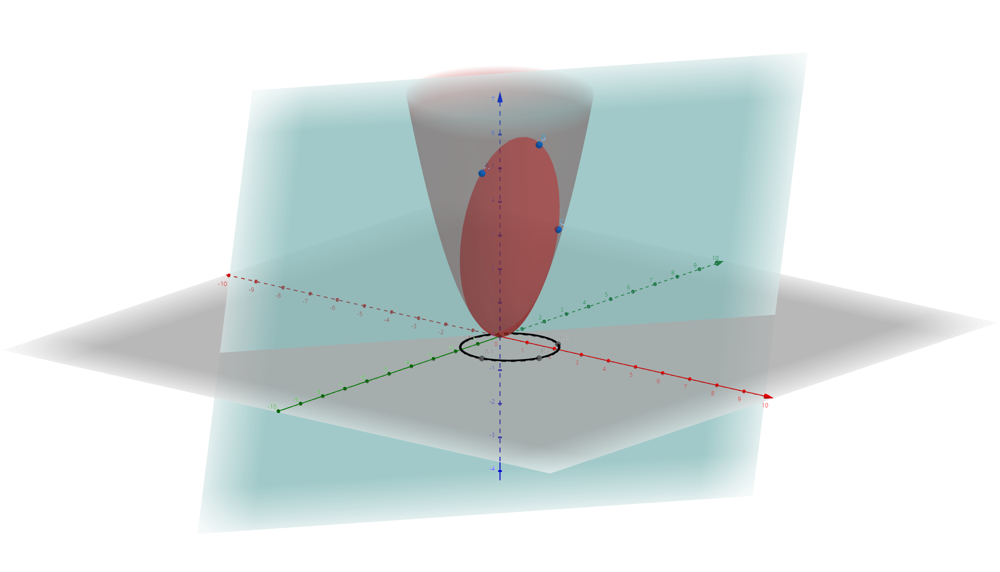

# 05点集三角刨分(Delaunary Triangulation)

本章主体为点集三角刨分。即给定一个平面点击。求一个建立在点上的最大边集，且边没有交叉。

* Point Set Triangulation
  * 介绍点集三角刨分的定义背景。并且基于凸包的知识直接给出了一个构造方案，给出了上下界。
* Delaunary Triangulation
  * 介绍DelaunaryTriangulation概念即其相关内容，后面称之为DT。先从前面介绍的Voronoi图入手。Voronoid图的对偶图即是一个三角刨分。
* Properties
  * 介绍Delaunary三角刨分的特性。
* Proximity Graph
  * 在本节介绍了两类图，其都为DT的子图。实际上DT是很多重要图的超图。
* Euclidean Minimum Spanning Tree
  * 介绍了EMST问题，即给定平面一堆点集，构造平面上的欧式距离最小生成树结构。使用基于DT的结构即可快速解决。
* Euclidean Traveling Salesman Problem
  * 欧几里得距离旅行商问题。这是一个经典NP-hard问题。本节基于EMST简单给出了一个算法结构。
* Minimum Weighted Triangulation
  * 介绍了最小权重的三角刨分概念，即MWT刨分。说明了其与DT的不同，说明其难度为NP-Hard。
* Construction
  * 主要讲解如何构造DT刨分。是从三角刨分形成的角度来说明的。最后介绍了几个构造策略，引入了随机化算法结构。
* RIC With Example
  * 主要介绍RIC算法。即Randomized Incremental Construction。每一次递增过程都随机添加操作。主要分为两步Insert和Update。Insert插入一个点，Update更新数据结构。
* Randomized Incremental Construction
  * 深入RIC算法，讲述整体实现。细化给出两个关键步骤的数据结构以及操作，圆内测试(In-Circle Test)和点定位(Point Location)。
* RIC Analysis
  * 对RIC算法进行一个时间分析。RIC算法的主要消耗在边交换(edge changes)与重新分桶(rebucketing)上面。

# InCircleTest

在RIC章节部分，老师给出了一个简短的InCircleTest计算方法。类似ToLeft测试一般，只用计算出符号就可以得出点$p$是否在三角形$a,b,c$的外界圆内，但是没有给出证明来源，这里做一个简短补充。

计算公式如下：

$$
\begin{vmatrix}
  a_x & a_y & a_x^2+a_y^2 & 1 \\
  b_x & b_y & b_x^2+b_y^2 & 1 \\
  c_x & c_y & c_x^2+c_y^2 & 1 \\
  p_x & p_y & p_x^2+p_y^2 & 1 \\
\end{vmatrix}
$$

这里其实计算的思路是，线性化和升维。对于一个二维圆公式我们有如下结构：

$$
(x-t_x)^2+(y-t_y)^2=r^2 \\
x^2-2xt_x+t_x^2+y^2-2yt_y+t_y^2=r^2
$$

这里我们可以认为点$t$就是这个圆的圆心，显然该公式是不能表示为$t_x,t_y$的线性化的，因为存在$t_x^2,t_y^2$两个项目。但是我们可以引入一个新的变量$R=r^2-t_x^2-t_y^2$则原公式可以做如下变形：

$$
2xt_x+2yt_y+R=x^2+y^2\\
\begin{bmatrix}
2x & 2y & 1
\end{bmatrix}
\begin{bmatrix}
t_x \\
t_y \\ 
R
\end{bmatrix}=x^2+y^2
$$

这里注意到对于平面三点共圆相当于三个点都在圆上，三个点$a,b,c$都满足方程。所以有如下等式：

$$
\begin{bmatrix}
a_x & a_y & 1 \\
b_x & b_y & 1 \\
c_x & c_y & 1 \\
\end{bmatrix}
\begin{bmatrix}
2t_x \\
2t_y \\ 
R
\end{bmatrix}=
\begin{bmatrix}
a_x^2+ a_y^2 \\ 
b_x^2+ b_y^2 \\ 
c_x^2+ c_y^2 \\ 
\end{bmatrix}
$$

这个线性方程组可以通过Cramer's Rule来求解出$t_x,t_y,R$，而$R$实际上包含了半径数值。

同时这个方法可以扩展到任意维度，三维就是要四个点，三个坐标。

现在我们考虑一个新的点$p$，这个点是平面给上任意一个点。并且设$p$到圆心的距离为$u$。我们自然有：

$$
(p_x-t_x)^2+(p_y-t_y)^2=u^2
$$

我们现在考察如下结构

$$
\begin{bmatrix}
a_x & a_y & 1 & 0\\
b_x & b_y & 1 & 0\\
c_x & c_y & 1 & 0\\
p_x & p_y & 1 & 1\\
\end{bmatrix}
\begin{bmatrix}
2t_x \\
2t_y \\ 
R \\
U
\end{bmatrix}=
\begin{bmatrix}
a_x^2+ a_y^2 \\ 
b_x^2+ b_y^2 \\ 
c_x^2+ c_y^2 \\ 
p_x^2+ p_y^2\\
\end{bmatrix}
,U=u^2-r^2
$$

可以验证最后一行是成立的。将该方程表示为$AT=B$，$A$为左侧矩阵，$T$为中间向量，$B$为右侧向量。注意根据Cramer's Rule，我们可以看到U的值可以表示为：

$$
U = \frac{1}{|A|}
\begin{vmatrix}
a_x & a_y & 1 & a_x^2+a_y^2\\
b_x & b_y & 1 & b_x^2+b_y^2\\
c_x & c_y & 1 & c_x^2+c_y^2\\
p_x & p_y & 1 & p_x^2+p_y^2\\
\end{vmatrix}
$$

注意其中$|A|$为三角形$a,b,c$的按顺序有向面积。所以此时U的符号取决于后面行列式，注意的是$U=u^2-r^2$。刚好是到目标点的距离，其符号说明了在圈外还是圈内。当行列式值大于0说明在圈外，反之说明在圈内。

此外值得注意的一点就是，我们考虑三个三维空间中的点$a,b,c$。三个点如果不共线，则可以确定一个平面这个平面可以表述如下：对于平面内的一点$p=(p_x,p_y,p_z)$有

$$
\vec{ap}\cdot(\vec{ab}\times\vec{ac})=0
$$

语义也非常明确即，面上$p$的点到$a$的向量都与面上的法向量$\vec{ab}\times\vec{ac}$垂直。在三维空间中如果用行列式展开有：

$$
\begin{vmatrix}
p_x-a_x & p_y-a_y & p_z-a_z \\
b_x-a_x & b_y-a_y & b_z-a_z \\
c_x-a_x & c_y-a_y & b_z-a_z \\
\end{vmatrix}=
\begin{vmatrix}
1 & 0 & 0 & 0 \\
0 & p_x-a_x & p_y-a_y & p_z-a_z \\
0 & b_x-a_x & b_y-a_y & b_z-a_z \\
0 & c_x-a_x & c_y-a_y & b_z-a_z \\
\end{vmatrix}=
\begin{vmatrix}
1 & a_x & a_y & a_z \\
1 & p_x & p_y & p_z \\
1 & b_x & b_y & b_z \\
1 & c_x & c_y & b_z \\
\end{vmatrix}
$$

如果该值大于0说明点$p$在平面法线上方，反之则在下方。对比这个公式跟我们上面的计算公式我们不难发现，对于平面上的点$a,b,c$，可以认为其就是做了一个映射，附加一个z方向值有$(a_x,a_y)\rightarrow(a_x,a_y,a_x^2+a_y^2)$。此时$p$在圈内的问题转化为了在平面上下方的问题。

令$z=x^2+y^2$我们可以看到这个三维图像实际上是一个抛物面。而我们上面所作的映射使得，平面所有点都落在了这个抛物面上面。落在这个抛物面上的点，即可形成一个平面。根据我们上面描述在该平面下方的会落在圆内，而上方的会落在园外。现在我们关注这个平面跟抛物线的截面，该截面会把整个抛物面分成两部分。两部分都可被平面上的点映射过来，可以看到，其实圆内的点就是其中一个有限截面在平面上的投影部分。如下图

